## <span style="color:#a165a1"> Roadmap </span>


```{mermaid}
flowchart LR
  A(Goals and Intro) --> B(Introduction to Tools)
  B --> C(Good Practices)
  C --> D(Example Development)
  style A fill:#612561
```

::: incremental
- Who and what is this (not) for?
- A note on software literacy among researchers.
:::

---


## Disclaimer

- I will assume some basic experience with coding.
- The aim is to only *raise awareness* of some key practices; tutorials are outside scope.
- Developer teams for large codebases (e.g., [ICON](https://www.icon-model.org/)) have more to consider than what is presented here.
- For brevity, only few examples of tools and services are shown.

---


## Goals for today

::: incremental
1. Help you increase research software *sustainability* and *impact* by adopting good development practices.

2. *Signpost* useful tools and services beyond IDEs and debuggers. (You can't look for/into something if you're unaware of its existence.)

3. *Demonstrate* some aspects of it with an example.
:::


---


## The state of research software

::: incremental
- Often *closed* source, *no licence, documentation, distribution mechanism*, etc.
- Software often developed and used for single project, then *abandoned*.
- Grant schemes just to address these issues (e.g., by the Software Sustainability Institute)
:::

---


## Software literacy among researchers

::: {.columns}
::: {.column width="45%"}
> "I need [insert random software package, specific IDE, expensive licence, etc.] to create good software."

*[Many students and ECRs]*
:::

::: {.column width="55%"}

Good software ...

::: incremental
1. addresses real (research) need.
2. is well designed, tested, and reliable.
3. is well documented and maintainable.
4. is developed with/for the community/users (adheres to standards, clean API)
5. has mechanisms for the above.
6. ... is open.
:::

:::
:::


<!--- speaker notes below -->

::: {.notes}

2. Has test suite.
3. Auto-generated API documentation with additional "user guide" (use doc tools)
4. Examples:
- no vendor specific compiler extensions
- API consistent and semantically meaningful
- use community standards for style (enforce with linter)
5. Doc tools (ford, sphinx), linter for style, contributor guide, mechanisms for feedback.

:::


---


## Software literacy among researchers

::: {.columns}
::: {.column width="50%"}
> "If your LLM gets code from open GitHub repositories, there are no concerns. They are public, so you're allowed to do anything."

*[Convener in computational EGU session]*
:::

::: {.column width="50%"}
:::
:::

<!--- speaker notes below -->

::: {.notes}

Many researchers are afraid of developing openly. One reason is low (OSS/software) literacy. Let's dispel some myths.

:::


---


## Software literacy among researchers

::: {.columns}
::: {.column width="50%"}
> "If your LLM gets code from open GitHub repositories, there are no concerns. They are public, so you're allowed to do anything."

*[Convener in computational EGU session]*
:::

::: {.column width="50%"}
![Licence breakdown on GitHub. Quote true for CC0. *[Balter, 2021]* ](img/gh_licenses.jpg){fig-align="left" width=100%}

Researcher understand plagiarism and intellectual property for research (articles), but often fail to acknowledge this for software.
:::
:::

---


## Software literacy among researchers

::: {.columns}
::: {.column width="25%"}
> "Open-source software (OSS) is a second-class budget copy of proprietary equivalents."

*[Many colleagues; paraphrased]*
:::


::: {.column width="65%"}

::: incremental
- OSS is backbone of global digital infrastructure and leads innovation; others usually follow/take from it (e.g., MacOS).

- Some facts and figures *[Hoffman et al., 2024]*:
  - OSS included in *96% of all codebases*.
  - OSS has economic value of *8.8T USD*.
  - Without OSS, *3.5x more* would have to be spent on development.
:::

:::
:::

---


## <span style="color:#a165a1"> Roadmap </span>

```{mermaid}
flowchart LR
  A(Goals and Intro) --> B(Introduction to Tools)
  B --> C(Good Practices)
  C --> D(Example Development)
  style A fill:#616161
  style B fill:#612561
```

Good practice supported by common tools:

::: incremental
- Git, code hosting
- Managing environments
- Language servers
- Linters
- Documentation tools
- Distribution and automatic deployment
:::

---


## Git – it's not black magic

`git` is a *distributed version control* system; an automated way to organise and track different versions of a software, where the complete codebase mirrored on the developer's computers.

Basic use examples:

- `git add [file or directory]` adds new or changed content to index

- `git commit -m "description of changes"` records changes to the code repository with a message

- `git push` updates your remote repository (e.g., on GitHub or Codeberg)

- `git pull` fetches update from remote repository

---


## Git GUI Clients

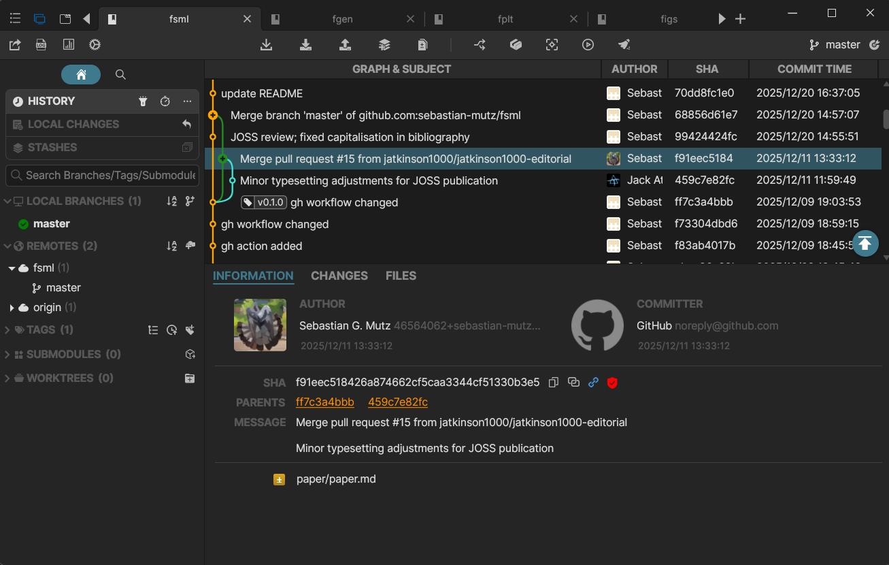{fig-align="left" width=50%}

---


## Hosting your code repository

::: {.columns}
::: {.column width="40%"}

{fig-align="left" width=25%}

`GitHub`

- very widely used platform
- lots of templates, but also gets bloated
- bought by MS, so MS services are pushed and MS will use your data/code (just-telling-it-how-it-is™)

:::

::: {.column width="10%"}
:::

::: {.column width="40%"}
{fig-align="left" width=25%}

`Codeberg`

- non-profit and community-driven
- specialising in open-source services
- GDPR compliant and hosted in EU

:::
:::

---


## Environment management

::: {.columns}
::: {.column width="40%"}

{fig-align="left" width=25%}

`conda`

- open-source and mature
- installs pre-compiled binaries
- lots of libraries available through *conda-forge*
:::

::: {.column width="10%"}
:::

::: {.column width="40%"}
{fig-align="left" width=25%}

`spack`

- open-source and mature
- compiles on your computer
- can build, install, and manage *multiple versions* of libraries without breaking other installations
- more flexible, finer control (popular for development for HPC)

:::
:::

---


## Language Servers: helping you code

::: {.columns}
::: {.column width="30%"}

- *Language Servers* are background processes that provide code editing features like auto-complete, error checking, and more. Can be enabled for specific languages in your editors.
- Decoupled from IDE code; can use language servers for various languages in same IDE.

:::
::: {.column width="5%"}
:::

::: {.column width="65%"}

) displays project-specific kind definitions and lists of module procedures. In this case, it is used in the [kate](https://kate-editor.org) editor.](img/fortls.png){fig-align="left" width=100%}

:::
:::

---


## Linters: keeping your code clean

::: {.columns}
::: {.column width="40%"}

- *Linters* are static code analysis tools that enforce style and formatting conventions, and flag "suspicious" parts of your code.
- *Examples:*
  - Fortran: [Fortitude](fortitude.readthedocs.io)
  - R: [lintr](https://lintr.r-lib.org/)
  - C/C++: [cpp-linter](https://cpp-linter.github.io/)
  - Python: [Ruff](https://docs.astral.sh/ruff/)

:::
::: {.column width="10%"}
:::

::: {.column width="40%"}

). Linters help you prevent writing code this this (unless you really want to).](img/ioccc_winner_2025_jhshrvdp.png){fig-align="left" width=100%}

:::
:::

---


## Distribution

::: {.columns}
::: {.column width="50%"}

Making it easy for others to use your software.

- *Rust*: Cargo
- *Fortran*: FPM (Fortran Package Manager)
- *R*: CRAN (Comprehensive R Archive Network)
- *Python*: pip/PyPI (Python Package Index)

:::
::: {.column width="50%"}

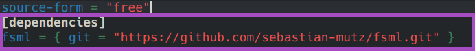{fig-align="left" width=100%}

{fig-align="left" width=100%}

:::
:::

---


## Automatic Documentation

::: {.columns}
::: {.column width="50%"}

`FORD`

 (Fortran Documenter) is another tool for automated documentation for `Fortran`.](img/ford.png){fig-align="left" width=100%}

:::
::: {.column width="50%"}


:::
:::

---


## Automatic Documentation

::: {.columns}
::: {.column width="50%"}

`FORD`

 (Fortran Documenter) is another tool for automated documentation for `Fortran`.](img/ford.png){fig-align="left" width=100%}

:::
::: {.column width="50%"}

`Sphinx`

 is a popular documentation tool. It is versatile and can be used for many languages.](img/sphinx.png){fig-align="left" width=100%}

:::
:::

---


## Automated deployment

::: {.columns}
::: {.column width="40%"}

- Using tools that will *automatically release code changes* (going from development environment right to end users).
- *Example*: This presentation takes advantage of *GitHub pages*; when the repository for this presentation is updated, the changes to this web presentation are automatically released.

:::

::: {.column width="60%"}

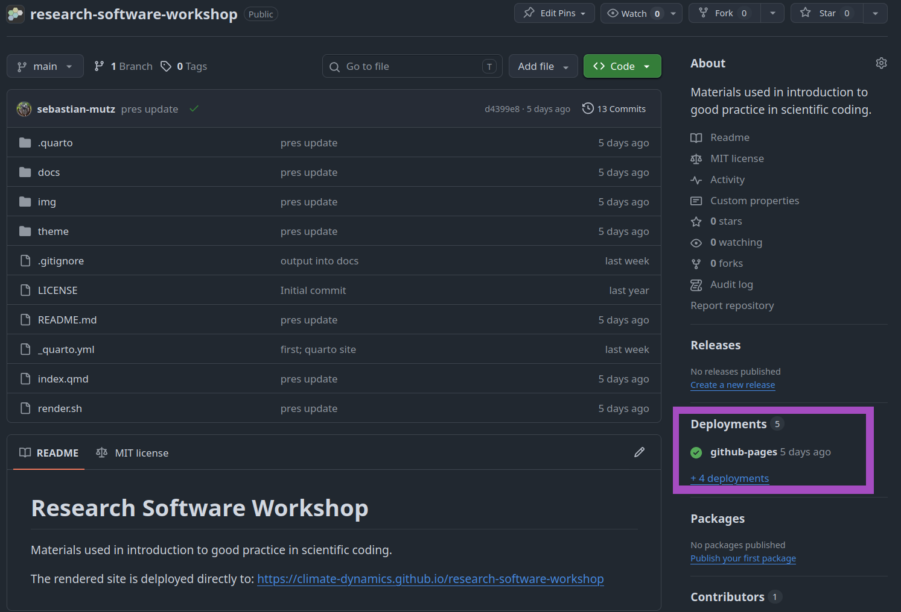{fig-align="left" width=100%}

:::
:::

---


## Automated deployment

*Let's try ...*

---


## <span style="color:#a165a1"> Roadmap </span>

```{mermaid}
flowchart LR
  A(Goals and Intro) --> B(Introduction to Tools)
  B --> C(Good Practices)
  C --> D(Example Development)
  style A fill:#616161
  style B fill:#616161
  style C fill:#612561
```

General good practice beyond technical tools:

::: incremental
- API design and semantics
- Documentation and user guide
- Involving community
- Increasing software visibility (in academia)
:::

---


## API (Application Programming Interface) design

A good API is easy to read and understand (semantically meaningful), complete and concise, and difficult to misuse.

### Example

::: incremental
`rinc(rf)`

- hard to understand; unclear what procedure is or arguments are.

`s_river_incision(rainfall_rate)`

- indicator of type of procedure (`s_` for subroutine)
- clearly, river incision is happening
- rainfall rate is passed as an argument - difficult to pass some other variable

:::

---


## Beyond automatic documentation

Documentation tools like *sphinx* or *FORD* let you enhance the automatically generated documentation with user guides and additional pages (generated from simple `markdown` or `rst` text files).

::: {.columns}
::: {.column width="45%"}

### Good API documentation

::: incremental
- explains underlying theory (e.g., stream power law)
- uses equations (`latex` usually supported by doc tools)
- specifies input and output exactly - dimensions, data types, and what it is (e.g., `rainfall_rate` - scalar of type *real64*; mean annual rainfall rate)
:::

:::
::: {.column width="10%"}

:::
::: {.column width="45%"}

### User Guide

::: incremental
- where/how to get the code?
- what are the dependencies?
- how to install the library and dependencies?
- how to use it in your project?
- **lots and lots of examples!**
:::

:::
:::

---


## Involve Community


::: {.columns}
::: {.column width="15%"}

{fig-align="left" width=100%}

:::
::: {.column width="85%"}

::: incremental
- make your repository *visible*
- decide on a *licence* (so users and contributors know what they can do with/to the software)
- create a *contributor guide* with style guidelines
- create a mechanism/guide for collecting *feedback* (e.g., GitHub issue templates)
- create a *code of conduct* for a healthy and friendly community
- *engage* with the community
:::

:::
:::

---


## Visibility and acknowledgement

::: {.columns}
::: {.column width="50%"}

{fig-align="left" width=100%}

[Geoscientific Model Development (GMD)](https://www.geoscientific-model-development.net/)

- open-access and community-driven
- transparent, but conventional review process (*focuses more on article* than code)
- *full length articles* and potential duplication of work (if you already have good documentation)

:::
::: {.column width="50%"}

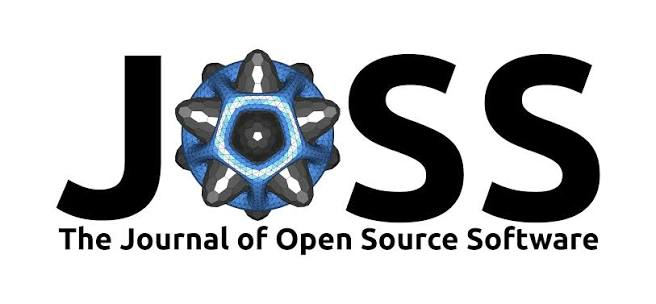{fig-align="left" width=100%}

[Journal of Open Source Software (JOSS)](https://joss.theoj.org/)

- open-access and community-driven
- transparent, fast, and *developer friendly* review (*focuses also on code and documentation*)
- *short articles*; signposts the documentation and work you have already done

:::
:::

---


## <span style="color:#a165a1"> Roadmap </span>

```{mermaid}
flowchart LR
  A(Goals and Intro) --> B(Introduction to Tools)
  B --> C(Good Practices)
  C --> D(Example Development)
  style A fill:#616161
  style B fill:#616161
  style C fill:#616161
  style D fill:#612561
```


::: {.columns}
::: {.column width="50%"}

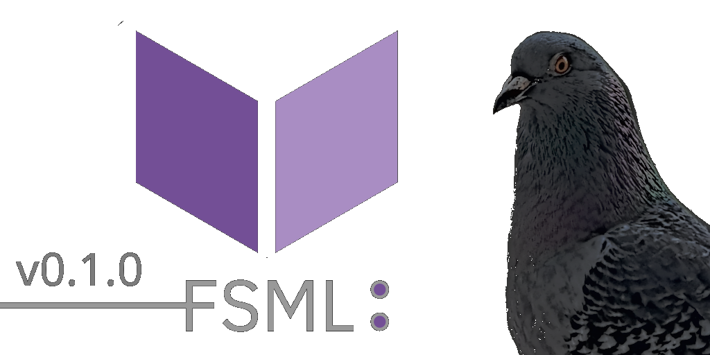{fig-align="left" width=100%}

:::
::: {.column width="50%"}

*Development journey*: How to turn your research code into a well-organised library?

:::
:::

---


## FSTAT: Old research toolbox

::: {.columns}
::: {.column width="20%"}

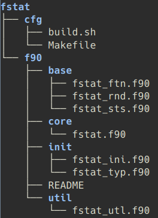{fig-align="left" width=100%}

:::
::: {.column width="80%"}

- *15+ years of code* development lived on my computer(s)
- *LAPACK* compiled and linked manually
- manual building and linking of *fstat* required
- no documentation; just code *comments and a README*
- useful only for me

:::
:::

---


## A new Fortran ecosystem and community

::: {.columns}
::: {.column width="40%"}

 and [fpm](https://github.com/fortran-lang/fpm) are among [fortran-lang](https://fortran-lang.org/)'s flagship projects.](img/fortran-lang.png){fig-align="left" width=100%}

 is a friendly and supportive online community of Fortran programmers; includes newcomers and Fortran standard committee members.](img/discourse.png){fig-align="left" width=100%}

:::
::: {.column width="60%"}

`fpm`

Fortran Package Manager makes building, running, and distributing Fortran projects hassle-free.

`stdlib`

The new standard library includes many useful procedures and includes modern lapack interfaces.

*"Perhaps it's worth modernising and opening up my toolbox?"*

:::
:::

---


## New structure and dependencies

::: {.columns}
::: {.column width="25%"}

 is organised into 5 thematic modules: Basic statistics (*STS*), hypothesis tests (*TST*), linear
procedures (*LIN*), non-linear procedures (*NLP*), and statistical distribution functions (*DST*).](img/fsml_modules.png){fig-align="left" width=100%}

:::
::: {.column width="5%"}

:::
::: {.column width="70%"}

::: incremental
- procedures updated, restructured, and categorised into 5 core modules
- migrated to *fpm* for building/distribution and *stdlib* for linear algebra
- *examples* and *tests* for all procedures
- developed to support [GFortran](https://gcc.gnu.org/wiki/GFortran) and interactive [LFortran](https://lfortran.org/) compiler
:::

:::
:::

---


## New API and consistent style

::: {.columns}
::: {.column width="45%"}

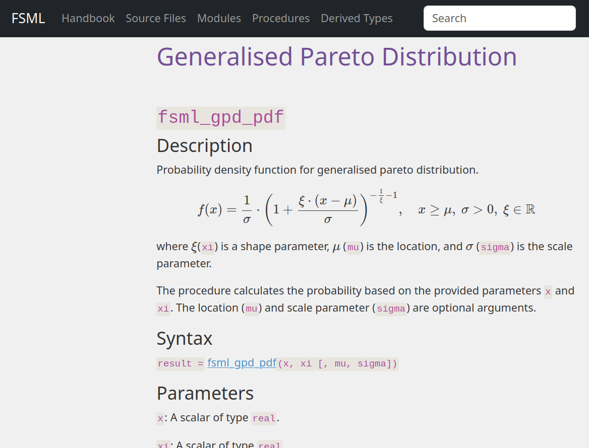{fig-align="left" width=100%}

:::
::: {.column width="5%"}

:::
::: {.column width="50%"}

::: incremental
- internal procedure names: *procedureType_module_procedure_suffix* (e.g., `s_dst_gpd_pdf_core` for pure procedure and `s_dst_gpd_pdf` for impure wrapper)
- API (through interface module): *fsml_procedure* (e.g., `fsml_gpd_pdf`); explicit and avoids name conflicts
:::

:::
:::

---


## Documentation (API and Handbook)

::: {.columns}
::: {.column width="45%"}

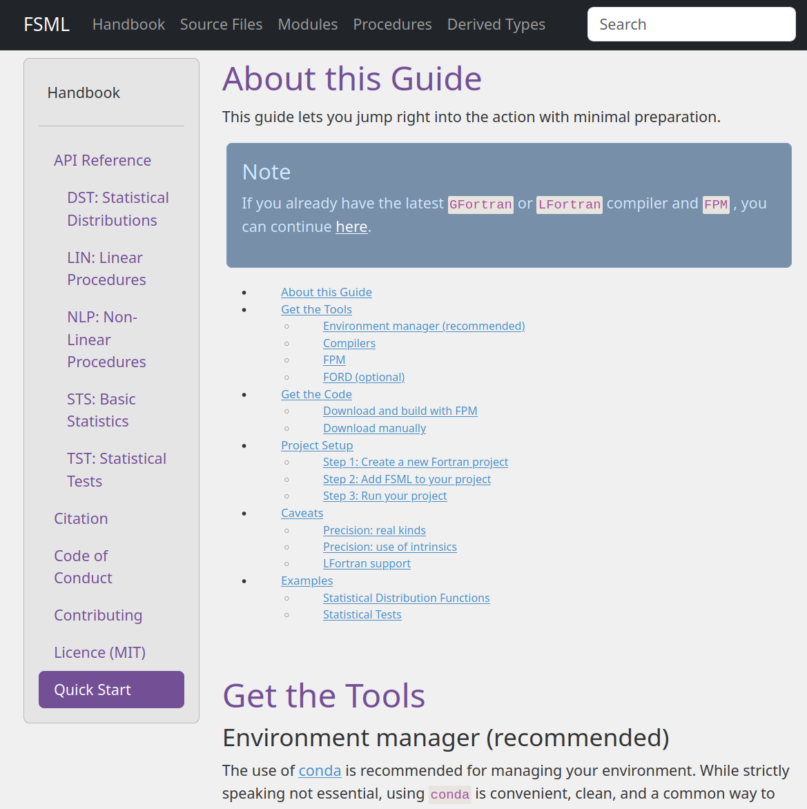{fig-align="left" width=100%}

:::
::: {.column width="5%"}

:::
::: {.column width="50%"}

::: incremental
- *API documentation* (previous slide)
- *Quick Start* tutorial
- Visible *license*, and *citation* instructions for users and contributors
:::

:::
:::

---


## Documentation (API and Handbook)

::: {.columns}
::: {.column width="45%"}

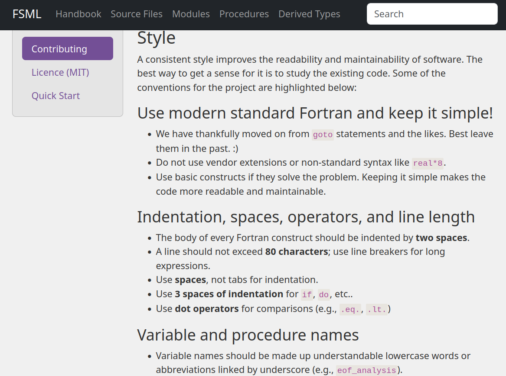{fig-align="left" width=100%}

:::
::: {.column width="5%"}

:::
::: {.column width="50%"}

::: incremental
- *Contributing* guidelines (style guide, conventions, instructions for raising issues, etc.)
- *Code of Conduct* (adapted from the [Contributor Covenant](https://www.contributor-covenant.org/), version 2.0); community impact guidelines inspired by Mozilla's [code of conduct](https://github.com/mozilla/inclusion).
:::

:::
:::

---


## Software Visibility

::: {.columns}
::: {.column width="50%"}

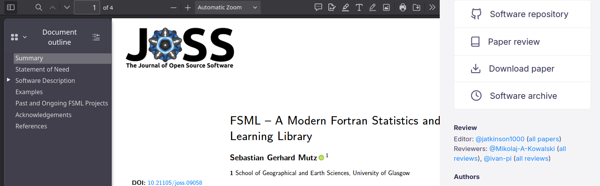{fig-align="left" width=100%}

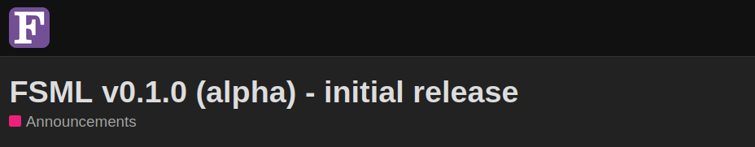{fig-align="left" width=100%}

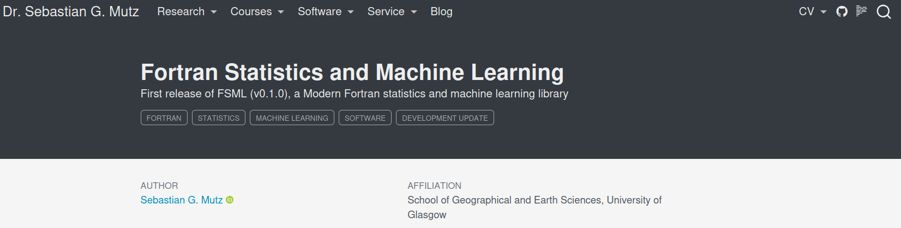{fig-align="left" width=100%}

:::
::: {.column width="50%"}

 (encouraged by community).](img/fsml_fwiki.png){fig-align="left" width=100%}

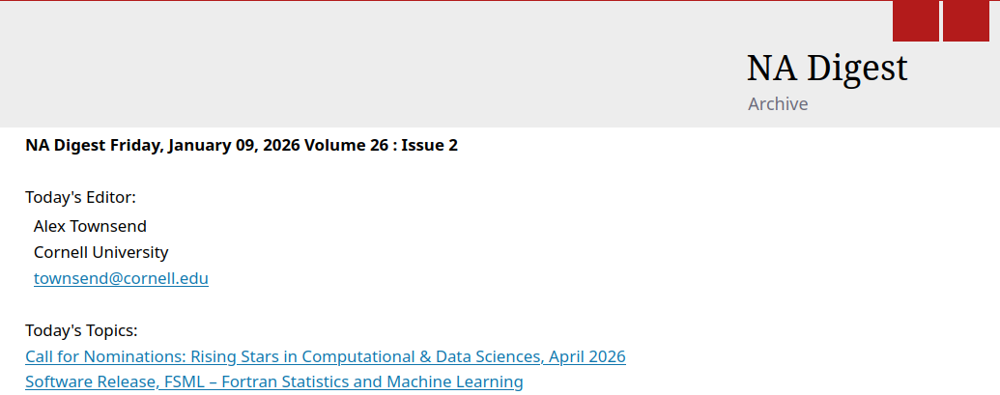{fig-align="left" width=100%}

 at EGU GA 26.](img/fsml_egu.png){fig-align="left" width=100%}

:::
:::

---


## Engagement, use, and prospects

::: {.columns}
::: {.column width="50%"}

- early adoption for research (*drought prediction*)
- *lowered barrier* for students interested in Fortran
- *new contributor* days after release announcement
- researches at NCI (National Computational Infrastructure) Australia consider adoption and contribution
- *proposals* resulted from community engagement

:::
::: {.column width="50%"}

 (expert in applied mathematics and fluid dynamics) adding *LASSO* to FSML.](img/loiseau.png){fig-align="left" width=100%}

:::
:::

---


## The future ...

::: {.columns}
::: {.column width="50%"}

- *rework and add more* procedures from *fstat* (e.g., Random Forests)
- add *ML utilities* to lower barrier for ML model development
- optimise further for *parallel execution*
- optimise for performance without sacrificing readability (some tested functions already >20x faster than scipy's)
- make the library usable in *jupyter notebooks* to lower barrier further ...

:::
::: {.column width="50%"}

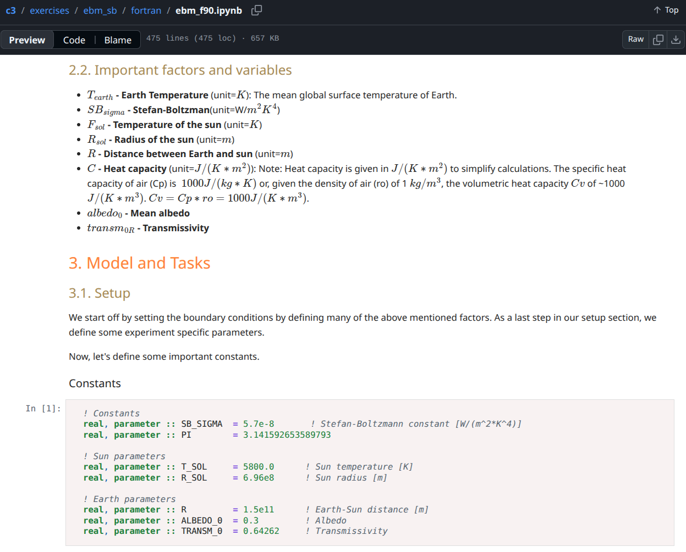{fig-align="left" width=100%}

:::
:::

---


## References
- Balter, Ben (2015; updated 2021) "Open source license usage on GitHub.com", GitHub Blog. [Link](https://github.blog/open-source/open-source-license-usage-on-github-com/)
- Hoffmann, Manuel, Frank Nagle, and Yanuo Zhou (2024) "The Value of Open Source Software." Harvard Business School Working Paper, No. 24-038.
- Mutz, S. G., (2025). "FSML – A Modern Fortran Statistics and Machine Learning Library". Journal of Open Source Software, 10(116), 9058, [https://doi.org/10.21105/joss.09058](https://doi.org/10.21105/joss.09058)


## Fin

::: {.columns}
::: {.column width="50%"}

{fig-align="left" width=100%}

:::
::: {.column width="50%"}

> “Yes, I’m aware of the legend Herbert.”

(Syed Danish Ali, July 2025)

:::
:::

---


